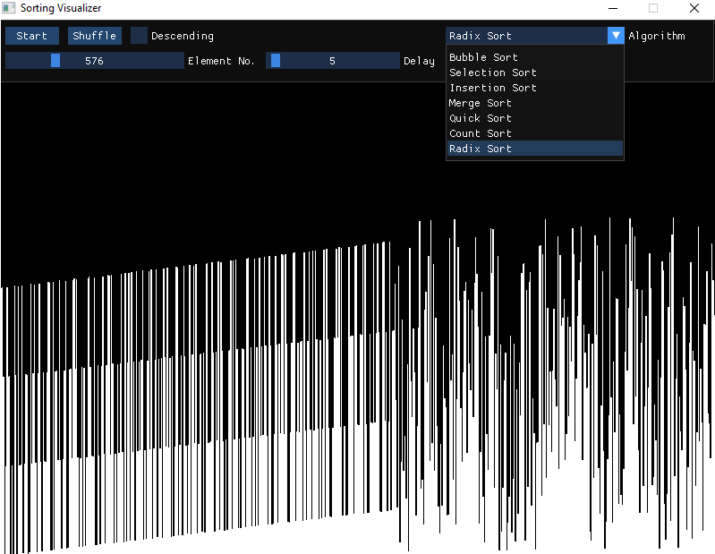

# Sorting Visualizer

## Overview

This is a sorting algorithm visualizer project that I am making with the purpose of learning the imgui library, and some basic usage of threads.

## Screenshots



## Dependencies

- make
- cmake

## Building

First to get the SFML dependency run the following commands:

```
cd sorting-visualizer
make install
```

That will clone the SFML library and build it and move all the files in the necessary folders, after that has 
been done, you can just build the project using `make` without any arguments.

Then you can run the executable and play with the program and explore. :)